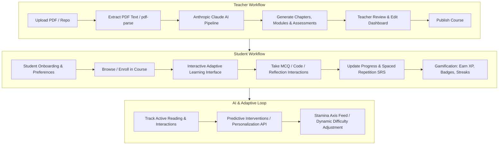

# Tidbit AI - Codebase Workflow & System Architecture Guide

> **Purpose:** This reference document consolidates the entire workflow, architecture, data schemas, API routes, and code patterns of Tidbit AI. Refer to this document when planning future features to avoid re-reading the entire codebase and save context/tokens.

---

## 🏛️ 1. Core Technology Stack & Architecture

- **Framework:** Next.js 14 (App Router with `src/app`)
- **Language:** TypeScript
- **Styling:** TailwindCSS + Custom CSS Tokens (`src/app/globals.css`)
- **Database:** MongoDB Atlas via Mongoose ORM (`src/lib/db`)
- **Authentication:** NextAuth.js (Credentials provider, JWT session, `src/middleware.ts`)
- **AI Engine:** Anthropic Claude API (`@anthropic-ai/sdk`, `src/lib/ai/anthropic.ts`)
- **Iconography & UI Components:** Lucide React + Standardized Design System (`src/components/ui`)

---

## 🔄 2. End-to-End System Workflows

---

## 🗄️ 3. Database Schemas Reference (`src/lib/db/models/`)

### 1. `User` (`User.ts`)
- `email`, `password` (hashed with bcrypt), `role` (`'teacher' | 'student'`)
- `name`, `avatar`
- `learningProfile`: `preferredPace`, `learningStyle`, `contentDepth`, `difficultyLevel`, `strengths`, `weaknesses`, `preferences`
- `accessibilitySettings`: high contrast, dyslexic font, reduce motion, etc.

### 2. `Course` (`Course.ts`)
- `teacherId` (Ref to User), `title`, `description`, `thumbnail`, `pdfUrl`, `rawContent`
- `isPublished` (boolean), `enrolledStudents` (Ref array to User), `chapters` (Ref array to Chapter)
- `learningOutcomes`, `interactiveSettings`, `teacherInstructions`, `codeResources`

### 3. `Chapter` (`Chapter.ts`)
- `courseId` (Ref to Course), `title`, `order`, `modules` (Ref array to Module)

### 4. `Module` (`Module.ts`)
- `chapterId` (Ref to Chapter), `title`, `content`, `contentType` (`'lesson' | 'interactive' | 'quiz'`)
- `contentBlocks`: Array of interactive text/question blocks (`mcq`, `fill_blank`, `reflection`, `reveal`, `confirm`, `code`)
- `aiGeneratedContent`: `{ summary, keyPoints, examples, practiceQuestions }`
- `multiModalContent`: Text, SVG visual diagrams/mindmaps, audio descriptions

### 5. `Assessment` (`Assessment.ts`)
- `courseId`, `chapterId`, `moduleId`, `type` (`'quiz' | 'assignment' | 'final'`)
- `questions`: Array of questions (MCQ, Short, Long, Interactive Code)
- `passingScore`, `timeLimit`

### 6. `StudentProgress` (`StudentProgress.ts`)
- `studentId`, `courseId`, `currentChapter`, `currentModule`
- `completedModules`, `completedChapters`
- `assessmentScores`: Array of `{ assessmentId, score, attempts, completedAt }`
- `moduleInteractions`: Per-module interactive response metrics
- `learningMetrics`: `averageTimePerModule`, `averageScore`, `streakDays`, `totalTimeSpent`, `adaptiveDifficulty`
- `gamification`: `{ totalXP, level, currentStreak, badges, weeklyGoal }`

### 7. `AIConversation` (`AIConversation.ts`)
- `studentId`, `moduleId`, `messages`: `{ role: 'user' | 'assistant', content, timestamp }`, `context`

### 8. `Enrollment` (`Enrollment.ts`)
- `studentId`, `courseId`, `enrolledAt`, `status` (`'active' | 'completed' | 'dropped'`)

### 9. `ReviewItem` (`ReviewItem.ts`)
- Spaced Repetition (SRS) items using SM-2 algorithm: `easeFactor`, `interval`, `repetitions`, `nextReviewDate`, `correctCount`, `incorrectCount`

### 10. `FeedCard` (`FeedCard.ts` - Feature 1)
- Tri-variant Stamina feed cards: `conceptKey`, `topicSequenceOrder`, `variants: { short, medium, long }`

---

## 📡 4. API Route Map (`src/app/api/`)

| Route Endpoint | Method | Purpose |
| :--- | :--- | :--- |
| `/api/auth/register` | `POST` | User registration (Teacher / Student) |
| `/api/courses` | `GET`, `POST` | List all courses or create a new course |
| `/api/courses/[id]` | `GET`, `PUT`, `DELETE` | View, edit, or delete a course |
| `/api/courses/[id]/generate` | `POST` | Trigger Anthropic Claude AI course creation from PDF |
| `/api/upload` | `POST` | PDF / file upload handler |
| `/api/enrollments` | `GET`, `POST` | Manage student enrollments |
| `/api/progress/[courseId]` | `GET`, `PUT` | Fetch and update student learning progress |
| `/api/chat` | `POST` | AI Tutor interactive conversation with module context |
| `/api/interactions/submit` | `POST` | Submit student responses to inline interactive blocks |
| `/api/gamification` | `GET` | Fetch XP, level, badges, and streaks |
| `/api/review` | `GET`, `POST` | Spaced repetition SRS review queue & submission |
| `/api/adaptive/personalize` | `POST` | Dynamic content adjustment based on student performance |
| `/api/feed/adaptive` | `GET` | Dynamic Stamina feed endpoint (returns short, medium, or long cards based on timer threshold) |
| `/api/student/analytics` | `GET` | Overall student analytics & progress stats |

---

## 🧩 5. Core Component System (`src/components/`)

### UI Fundamentals (`src/components/ui/`)
- `Button.tsx`, `Card.tsx`, `Input.tsx`, `Modal.tsx`, `Spinner.tsx`, `Toast.tsx`, `Badge.tsx`, `ProgressBar.tsx`

### Interactive Learning Blocks (`src/components/interactive/`)
- `MCQInteraction.tsx`: Multiple choice question with immediate AI feedback.
- `FillBlankInteraction.tsx`: Fill in the blank exercises.
- `ReflectionInteraction.tsx`: Open-ended AI-graded text reflection.
- `CodeInteraction.tsx`: Coding exercises with multi-language starter code & test cases.
- `ConfirmInteraction.tsx`: Check understanding self-assessment.

### Multi-Modal Content Renderers (`src/components/content/`)
- `DiagramRenderer.tsx`, `FlowchartRenderer.tsx`, `MindmapRenderer.tsx` (Renders visual learning aids).
- `MultiModalRenderer.tsx` (Renders text, SVG diagrams, and audio descriptions based on student preference).

### Student Analytics & Gamification (`src/components/student/`)
- `XPProgressBar.tsx`: XP and Level progression.
- `StreakCounter.tsx`: Fire streak counter.
- `BadgeDisplay.tsx`: Achievement badges grid.
- `DailyChallenge.tsx`: Daily target quest.
- `DailyReview.tsx`: Spaced Repetition review prompt.
- `LearningPreferencesOnboarding.tsx`: Onboarding questionnaire.

---

## 🤖 6. AI Engine Services (`src/lib/ai/anthropic.ts`)

The Anthropic AI client manages all AI tasks across the application:
1. **Course Outline Generation**: Takes PDF raw text -> identifies chapter structure and module breakdown.
2. **Module Content Generation**: Generates comprehensive lessons, key points, summaries, and interactive content blocks.
3. **Assessment & Distractor Generation**: Creates balanced MCQ options, short answer rubrics, and coding test cases.
4. **AI Tutor Companion**: Conversational assistant primed with module context to answer student queries.
5. **Adaptive Content Personalization**: Rewrites content or provides remedial/challenge material based on student accuracy.

---

## ⚡ 7. Guidelines for Creating Future Implementation Plans

When designing an implementation plan for new features:
1. **Reference Existing Models**: Extend types in `src/types/index.ts` and models in `src/lib/db/models/`.
2. **Follow API Patterns**: Return standard JSON responses `{ success: boolean, data?: T, error?: string }`.
3. **Leverage Pre-built UI**: Reuse `@/components/ui` (`Card`, `Button`, `Modal`, `Spinner`) and `@/components/interactive` components.
4. **Integrate Gamification**: Trigger XP updates via `/api/gamification` or progress updates via `/api/progress/[courseId]`.
