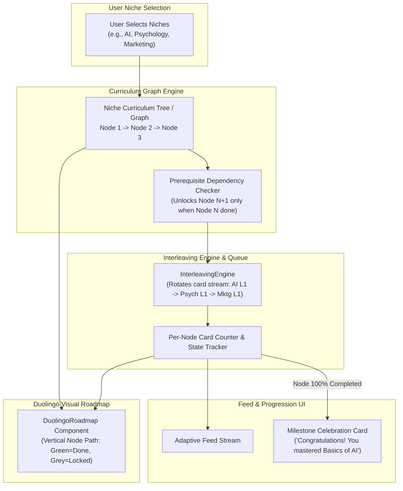

# Feature 2: Curriculum Graph & Topic Depth (Axis 2 - Depth Progression)
## Detailed Implementation Plan

---

## 📋 Feature Overview

**Feature Name:** Feature 2: Curriculum Graph & Topic Depth (Axis 2 - Depth Progression)  
**Code Review Reference:** [`docs/architecture/codebase-workflow-and-architecture.md`](file:///e:/HACKATHON/Dora%20Dao/Tidbit-AI/docs/architecture/codebase-workflow-and-architecture.md)  
**Objective:** Replace unstructured, random feed algorithms with a structured, prerequisite-based curriculum graph. The system sequences learning cards by depth (e.g., *Basics of AI -> Machine Learning -> Neural Networks -> Prompt Engineering*), tracks node completion, interleaves multi-niche feeds, triggers celebratory Milestone Cards, and renders a Duolingo-style visual learning path roadmap.

---

## 🏗️ Architecture & Data Flow

---

## 🎯 Technical Requirements Breakdown

### Requirement A: The Hidden Syllabus (Curriculum Graph Engine)
* **Graph Structure**: Each niche (e.g. *Artificial Intelligence*, *Psychology*, *Marketing*, *Content Writing*) consists of an ordered directed graph of learning nodes.
  - `Node 1`: Introductory definitions & high-level mental models.
  - `Node 2`: Practical use-cases & real-world applications.
  - `Node 3`: Core mechanics & technical limitations.
  - `Node 4`: Advanced strategies & future directions.
* **Prerequisite Enforcement**: Node $K+1$ cannot be served until Node $K$ requirements (e.g., 5–10 cards) are completed by the student.

### Requirement B: Node Progress Tracking & Milestone Celebration
* **Progress Tracking**: Tracks `cardsCompletedInNode` and `totalCardsInNode` per niche for each student in `StudentLearningPath`.
* **Milestone Trigger**: When `cardsCompletedInNode === totalCardsInNode`, the node switches state to `'mastered'`.
* **Milestone Card (`MilestoneCard.tsx`)**:
  - Injected directly into the feed stream on node completion.
  - Celebratory visual design with XP rewards (+100 XP badge), progress confetti animation, social share button ("I just mastered Basics of AI!"), and a preview of the upcoming node.

### Requirement C: The Interleaving Engine (`src/lib/curriculum/interleavingEngine.ts`)
* **Multi-Niche Interleaving**: If a user subscribes to $M$ niches (e.g., AI, Psychology, Marketing), the algorithm builds an interleaved feed queue:
  - `Slot 1`: Niche 1 (AI) - Active Node Card 1
  - `Slot 2`: Niche 2 (Psychology) - Active Node Card 1
  - `Slot 3`: Niche 3 (Marketing) - Active Node Card 1
  - `Slot 4`: Niche 1 (AI) - Active Node Card 2
* **Sequence Integrity**: Interleaving changes topic breadth per swipe, but **never** skips prerequisite node order within any individual niche.

### Requirement D: The Duolingo-Style Visual Roadmap (`src/components/roadmap/DuolingoRoadmap.tsx`)
* **Visual Duolingo Path**: Renders a vertical snake/zigzag node path UI for each niche:
  - 🟢 **Green / Glowing Node**: Mastered / Active Unlocked Node.
  - 🔒 **Grey Lock Node**: Locked future prerequisite node.
  - 🏆 **Trophy Marker**: End of Niche Milestone Node.
* **Interactive Node Modal**: Clicking any node opens a breakdown sheet showing total cards, estimated completion time, current card count, and topic summary.
* **Hackathon Visual Proof**: Serves as solid visual evidence for judges demonstrating deep backend logic and progress tracking.

---

## 📂 Files to Create & Modify

| Action | File Path | Purpose |
| :--- | :--- | :--- |
| **Modify** | `src/types/index.ts` | Add `CurriculumNode`, `NicheProgress`, `InterleavedQueueItem` interfaces |
| **Modify** | `src/lib/db/models/LearningPath.ts` | Extend `StudentLearningPath` to track per-niche node card completions |
| **Create** | `src/lib/db/models/NicheCurriculum.ts` | Mongoose schema for Niche Curriculum Trees & Concept Nodes |
| **Create** | `src/lib/curriculum/interleavingEngine.ts` | Interleaving queue generator for multi-niche feed streams |
| **Create** | `src/lib/curriculum/graphEngine.ts` | Prerequisite evaluator and node unlock manager |
| **Create** | `src/app/api/curriculum/roadmap/route.ts` | API to fetch student's visual roadmap nodes and niche progress |
| **Create** | `src/app/api/curriculum/interleaved-feed/route.ts` | API route delivering interleaved depth-progression feed cards |
| **Create** | `src/components/feed/MilestoneCard.tsx` | Celebratory milestone card with social share & XP reward |
| **Create** | `src/components/roadmap/DuolingoRoadmap.tsx` | Duolingo-style vertical node path visual roadmap component |
| **Create** | `src/app/(dashboard)/student/roadmap/page.tsx` | Student Roadmap & Learning Path page |
| **Modify** | `src/app/(dashboard)/student/page.tsx` | Add link & preview card for Duolingo Visual Roadmap |

---

## 🛠️ Step-by-Step Task Breakdown

### Phase 1: Schema & Data Model Extensions
- [ ] Update `src/types/index.ts` with `NicheCurriculum` and `InterleavedFeedItem` types.
- [ ] Create `NicheCurriculum` model in `src/lib/db/models/NicheCurriculum.ts`.
- [ ] Extend `StudentLearningPath` in `src/lib/db/models/LearningPath.ts` to store per-niche node progress `{ nicheId, nodeIndex, cardsViewed }`.

### Phase 2: Graph & Interleaving Logic Engines
- [ ] Build `src/lib/curriculum/graphEngine.ts`:
  - `getUnlockedNodes(studentId, nicheIds)`: Returns current active node for each selected niche.
  - `advanceNodeProgress(studentId, nicheId, cardId)`: Increments node card count; unlocks next node when complete.
- [ ] Build `src/lib/curriculum/interleavingEngine.ts`:
  - `generateInterleavedQueue(nicheNodeMap)`: Generates round-robin card sequence across active niche nodes.

### Phase 3: APIs & Milestone Card Component
- [ ] Create `src/components/feed/MilestoneCard.tsx`:
  - Visual celebration badge, +100 XP award, share button, and "Next Node" preview.
- [ ] Build `src/app/api/curriculum/interleaved-feed/route.ts`:
  - Fetches interleaved cards for user's selected niches and injects `MilestoneCard` payloads upon node completion.
- [ ] Build `src/app/api/curriculum/roadmap/route.ts`:
  - Returns node list with statuses (`'completed' | 'active' | 'locked'`) for Duolingo roadmap rendering.

### Phase 4: Duolingo Visual Roadmap UI
- [ ] Build `src/components/roadmap/DuolingoRoadmap.tsx`:
  - Vertical node path with custom SVG connectors, color-coded node badges (Green/Blue/Grey), and node detail modals.
- [ ] Create student page `src/app/(dashboard)/student/roadmap/page.tsx`.

### Phase 5: Student Dashboard Integration & Demo Setup
- [ ] Add "Curriculum Roadmap" card and active milestone progress bar to `src/app/(dashboard)/student/page.tsx`.
- [ ] Seed initial Niche Curriculum trees (AI, Psychology, Marketing) for hackathon demo.
