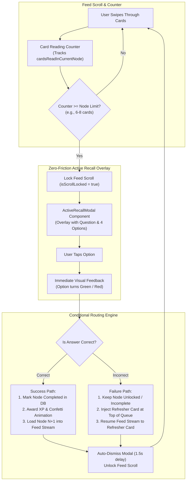

# Feature 3: Active Recall & MCQ Pop-ups (The Speed Breaker)
## Detailed Implementation Plan

---

## 📋 Feature Overview

**Feature Name:** Feature 3: Active Recall & MCQ Pop-ups (The Speed Breaker)  
**Code Review Reference:** [`docs/architecture/codebase-workflow-and-architecture.md`](file:///e:/HACKATHON/Dora%20Dao/Tidbit-AI/docs/architecture/codebase-workflow-and-architecture.md)  
**Objective:** Eliminate passive micro-learning scrolling by introducing mandatory, frictionless Active Recall quiz pop-ups after completing a logical unit of cards. Correct answers unlock the next topic with celebratory XP, while incorrect answers inject a short "Refresher Card" into the feed stream to reinforce retention without harsh punishment.

---

## 🏗️ Architecture & Data Flow



---

## 🎯 Technical Requirements Breakdown

### Requirement A: The Trigger Logic & Scroll Lock (`useActiveRecallTrigger.ts`)
* **Tracking Counter**: Maintains `cardsReadInCurrentNode` state for the current active topic node.
* **Trigger Condition**: When `cardsReadInCurrentNode >= nodeTargetCount` (default: 6 cards per node), the feed emits a scroll-lock event (`isScrollLocked = true`) preventing further swipe-up gestures.
* **Modal Trigger**: Launches `ActiveRecallModal` pre-populated with the node's tagged assessment question.

### Requirement B: Zero-Friction Quiz Modal UI (`ActiveRecallModal.tsx`)
* **Overlay Architecture**: Fixed backdrop blur modal (`z-50`) rendered over the snap-scroll feed.
* **Content Components**:
  - Node Title Badge (e.g. *"Quick Check: Basics of Neural Networks"*).
  - Clear Question Statement + 4 tap-able option buttons.
* **Immediate Feedback & Auto-Dismiss**:
  - Tapping an option immediately styles it (Green for correct, Red for wrong).
  - Trigger `confetti` animation on correct answer.
  - Auto-dismisses after 1.5 seconds without requiring a manual "Next" button click, eliminating interaction friction.

### Requirement C: Conditional Routing Engine (`src/lib/curriculum/activeRecallRouter.ts`)
* **Success State Routing**:
  - Updates `StudentLearningPath` status for current node to `'completed'`.
  - Grants +50 Active Recall XP to student gamification profile (`/api/gamification`).
  - Fetches and buffers cards for Node $N+1$ in the feed sequence.
* **Failure State Routing**:
  - Does **not** penalize the user.
  - Retrieves the **Refresher Card** content payload associated with the failed question.
  - Injects the Refresher Card directly at `index = currentIndex + 1` in the active feed array.
  - User immediately sees the short, simplified explanation on their next swipe down.

### Requirement D: Content Mapping Schema (`FeedCard.ts` / `NicheCurriculum.ts`)
* **Pre-mapped Quiz Payload**: Every concept node or card batch contains:
  ```typescript
  export interface ActiveRecallQuiz {
    id: string;
    nodeId: string;
    question: string;
    options: Array<{
      id: string;
      text: string;
      isCorrect: boolean;
      explanation?: string;
    }>;
    refresherCard: {
      title: string;
      summary: string;
      keyTakeaway: string;
      bulletPoints: string[];
    };
  }
  ```

---

## 📂 Files to Create & Modify

| Action | File Path | Purpose |
| :--- | :--- | :--- |
| **Modify** | `src/types/index.ts` | Add `ActiveRecallQuiz`, `QuizResponse`, `RefresherCard` interfaces |
| **Modify** | `src/lib/db/models/FeedCard.ts` | Attach `activeRecallQuiz` payload to node card groups |
| **Create** | `src/hooks/useActiveRecallTrigger.ts` | Counter & scroll-lock manager hook for speed breaker quizzes |
| **Create** | `src/lib/curriculum/activeRecallRouter.ts` | Logic engine handling success node updates vs refresher card injection |
| **Create** | `src/app/api/curriculum/active-recall/submit/route.ts` | API route for evaluating quiz response & returning routing payload |
| **Create** | `src/components/feed/ActiveRecallModal.tsx` | Zero-friction quiz overlay with immediate green/red feedback & auto-dismiss |
| **Create** | `src/components/feed/RefresherCard.tsx` | Specialized card layout for injected remedial summary explanations |
| **Modify** | `src/components/feed/AdaptiveFeed.tsx` | Integrate scroll-lock state & inject refresher cards into active feed queue |

---

## 🛠️ Step-by-Step Task Breakdown

### Phase 1: Types & Data Model Mapping
- [ ] Extend `src/types/index.ts` with `ActiveRecallQuiz` and `RefresherCard` types.
- [ ] Update `FeedCard` schema in `src/lib/db/models/FeedCard.ts` to support embedded quiz and refresher card schemas.

### Phase 2: Trigger & Scroll-Lock Hook
- [ ] Build `useActiveRecallTrigger.ts`:
  - Tracks `cardsReadInCurrentNode`.
  - Exposes `isScrollLocked`, `activeQuizPayload`, `triggerQuiz()`, `resetTrigger()`.

### Phase 3: Modal UI & Immediate Feedback Component
- [ ] Build `src/components/feed/ActiveRecallModal.tsx`:
  - Renders overlay modal.
  - Implements option selection styling (Green/Red).
  - Implements 1.5s auto-dismiss timer and confetti burst for correct answers.

### Phase 4: Conditional Routing & Refresher Injection API
- [ ] Build `src/lib/curriculum/activeRecallRouter.ts`:
  - Handles node completion on success.
  - Injects `RefresherCard` payload into feed buffer on failure.
- [ ] Create API route `src/app/api/curriculum/active-recall/submit/route.ts`.
- [ ] Build `src/components/feed/RefresherCard.tsx` UI component.

### Phase 5: Integration & Hackathon Verification
- [ ] Connect `ActiveRecallModal` and `useActiveRecallTrigger` into `AdaptiveFeed.tsx`.
- [ ] Test success path: verify node unlocks and XP increases.
- [ ] Test failure path: verify Refresher Card appears immediately on next swipe.
