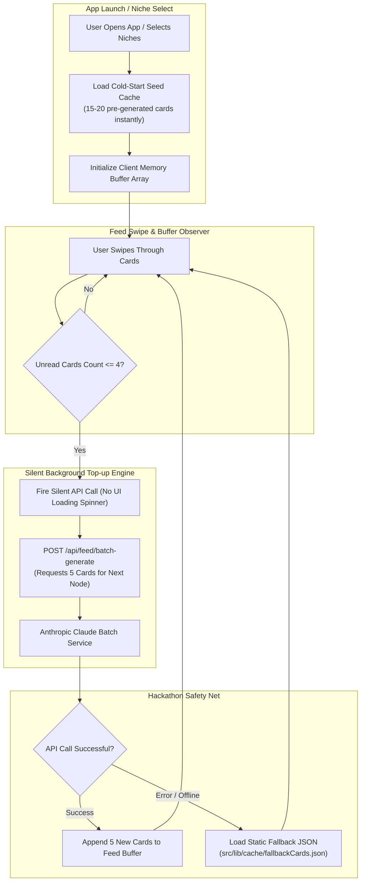

# Feature 4: Background Pre-fetch & Buffer
## Detailed Implementation Plan

---

## 📋 Feature Overview

**Feature Name:** Feature 4: Background Pre-fetch & Buffer  
**Code Review Reference:** [`docs/architecture/codebase-workflow-and-architecture.md`](file:///e:/HACKATHON/Dora%20Dao/Tidbit-AI/docs/architecture/codebase-workflow-and-architecture.md)  
**Objective:** Deliver a zero-latency, TikTok-like feed experience by pre-caching cold-start content, monitoring buffer levels silently, generating 5-card batches via Anthropic Claude in the background before the buffer depletes, and providing a robust offline fallback safety net for hackathon demonstrations.

---

## 🏗️ Architecture & Data Flow

---

## 🎯 Technical Requirements Breakdown

### Requirement A: The Initial Cache & Cold-Start Seed (`src/lib/cache/coldStartCache.ts`)
* **Instant Availability**: App launches with 15–20 pre-curated cards per niche stored locally in database/static JSON.
* **Zero Initial Load Time**: Initial rendering fetches cards directly from memory cache (0ms delay) so the user never sees a splash screen or blank state.

### Requirement B: The Background Buffer Observer (`src/hooks/useFeedBufferManager.ts`)
* **Buffer State Monitoring**: Tracks `currentIndex` and `feedBuffer.length`.
* **Silent Threshold Trigger**: When `unreadCards = feedBuffer.length - currentIndex <= 4`, the hook triggers a background fetch without setting any global UI loading spinners or freezing user interaction.
* **Debounce & Lock Protection**: Prevents duplicate concurrent API calls if the user rapidly swipes multiple cards in succession.

### Requirement C: Batch Generation API & Cost Saver (`/api/feed/batch-generate`)
* **Batch Endpoint**: `POST /api/feed/batch-generate`.
* **Prompt Optimization**: Sends a single Anthropic Claude prompt requesting 5 sequential concept cards for the current topic node.
* **Silent Append**: The 5 newly generated cards are seamlessly appended to the end of the client feed array. Because the user is busy reading cards 1, 2, and 3, cards 5, 6, 7, 8, 9 arrive in background memory long before the user reaches them.

### Requirement D: Hackathon Safety Net & Fallback System (`fallbackCards.json`)
* **Robust Error Shield**: In hackathons, Wi-Fi drops, rate limits, or API key exhaustion are common.
* **Graceful Fallback**: If the background fetch fails or times out (5000ms timeout), the catch block silently loads pre-built fallback cards from `src/lib/cache/fallbackCards.json` into the buffer stream.
* **Zero Crash Guarantee**: The app never crashes, never locks, and never displays a blank card during live presentation.

---

## 📂 Files to Create & Modify

| Action | File Path | Purpose |
| :--- | :--- | :--- |
| **Modify** | `src/types/index.ts` | Add `BufferState`, `BatchGenerateRequest`, `BatchGenerateResponse` interfaces |
| **Create** | `src/lib/cache/coldStartCache.ts` | Seed loader providing instant 15-card cold-start memory cache |
| **Create** | `src/lib/cache/fallbackCards.json` | Static fallback JSON backup containing emergency cards for hackathon demos |
| **Create** | `src/hooks/useFeedBufferManager.ts` | Custom hook monitoring unread cards and executing silent top-ups |
| **Create** | `src/lib/ai/batchFeedGenerator.ts` | Anthropic Claude batch generator service (5 cards per API call) |
| **Create** | `src/app/api/feed/batch-generate/route.ts` | Batch card generation API endpoint |
| **Modify** | `src/components/feed/AdaptiveFeed.tsx` | Integrate `useFeedBufferManager` to maintain zero-latency scrolling |

---

## 🛠️ Step-by-Step Task Breakdown

### Phase 1: Cold-Start Seed & Fallback JSON Data
- [ ] Create `src/lib/cache/fallbackCards.json` with 20 high-quality emergency cards across main topics (AI, Psychology, Marketing).
- [ ] Implement `src/lib/cache/coldStartCache.ts` to return instant cache on app load.

### Phase 2: Anthropic Batch Generation Engine
- [ ] Create `src/lib/ai/batchFeedGenerator.ts` with Claude system prompt engineered to output 5 structured tri-variant cards in JSON format.
- [ ] Implement API handler `src/app/api/feed/batch-generate/route.ts`.

### Phase 3: Buffer Manager Hook & Silent Fetch Observer
- [ ] Build `src/hooks/useFeedBufferManager.ts`:
  - Tracks `unreadCount`.
  - Implements silent background fetch when `unreadCount <= 4`.
  - Implements error fallback loading from `fallbackCards.json`.

### Phase 4: Feed Component Integration
- [ ] Connect `useFeedBufferManager` into `AdaptiveFeed.tsx`.
- [ ] Ensure swipe physics remain continuous while array state appends new items in background.

### Phase 5: Verification & Stress Testing
- [ ] Test zero-latency scrolling under fast swipe simulation.
- [ ] Test offline network fallback by disconnecting internet during live scroll.
